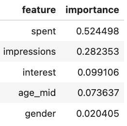

# 📊 Ad Click & Conversion Prediction + Spend Optimization

## 🚀 Overview

This project builds a machine learning pipeline to **predict ad conversion performance** and extends into **ad spend optimization** by identifying the most efficient budget range (“sweet spot”).

The goal is to simulate how data science can support **ads ranking, budget allocation, and campaign optimization** in platforms like TikTok, Meta, or Google.

---

## 💼 Business Problem

Digital advertisers face a key challenge:

> How do we allocate budget efficiently to maximize conversions without wasting spend?

This project answers:
- Which campaigns are likely to convert?
- What drives conversion performance?
- At what spend level do diminishing returns begin?

---

## 📦 Dataset

- Source: Kaggle – *KAG Conversion Data*
- Granularity: Campaign / Ad-level performance

### Key Features:
- `age`, `gender`, `interest` → audience targeting
- `impressions`, `clicks` → engagement metrics
- `spent` → ad budget
- `total_conversion` → conversion outcome

---

## 🧠 Modeling Approach

### 1. Conversion Classification
Predict whether an ad will convert using:
- Logistic Regression
- Random Forest

### 2. Conversion Prediction (Regression)
Estimate expected conversions:
- Linear Regression
- Polynomial Regression (for nonlinear effects)

### 3. Spend Optimization
- Model relationship: **spend → conversion**
- Compute **marginal return**
- Identify **sweet spot budget range**

---

## 📊 Model Performance

### Classification Results

| Model              | Accuracy |
|-------------------|----------|
| Logistic Regression | 0.66     |
| Random Forest       | 0.86     |

👉 Random Forest significantly outperforms Logistic Regression, capturing nonlinear relationships in ad performance.

---

## 📈 ROC Curve

- Logistic AUC: ~0.65 → weak separation  
- Random Forest AUC: ~0.94 → strong predictive power  

👉 Random Forest is highly effective at distinguishing high vs low conversion campaigns.

---

## 📉 Confusion Matrix

- Balanced precision and recall across both classes  
- Strong performance in both positive and negative predictions  

---

## 🔍 Feature Importance

Top drivers of conversion:
1. **Spent (52%)** → strongest predictor  
2. **Impressions (28%)** → exposure matters  
3. **Interest targeting (10%)** → audience relevance  
4. Demographics (minor impact)

👉 Conversion performance is primarily driven by **budget + reach**, with targeting playing a secondary role.

---

## 📈 Spend vs Conversion (Optimization)

To identify optimal budget allocation:
- Modeled **nonlinear relationship** using polynomial regression
- Computed **marginal return** (conversion gain per unit spend)

---

## 🎯 Sweet Spot Insight

- Conversion increases with spend initially  
- Gains begin to flatten → diminishing returns  
- Optimal spend lies within a **high-efficiency range**

👉 Beyond this range, additional spend produces **lower incremental returns**

---

## 🧠 Key Insights

- Random Forest captures complex ad performance patterns effectively  
- Budget and exposure dominate conversion outcomes  
- Linear models fail to capture diminishing returns  
- Polynomial modeling enables realistic spend-response analysis  
- Optimization should focus on **efficiency, not maximum spend**

---

## ⚠️ Limitations

- Observational data → not causal  
- Spend is correlated with impressions (multicollinearity)  
- No time-series or user-level granularity  

👉 Real-world deployment should include **A/B testing validation**

---

## 💡 Business Impact

This project demonstrates how machine learning can:

- Improve ad ranking and targeting  
- Predict high-performing campaigns  
- Optimize budget allocation  
- Reduce wasted ad spend  

---

## 📂 Project Structure
